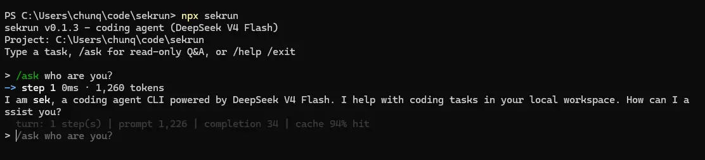

# Sekrun CLI

**sekrun** is a coding agent CLI powered by **DeepSeek V4 Flash**. It runs entirely on Node.js with **zero npm dependencies** — just the standard library.

It can read, write, search, and edit files, execute shell commands, and interact with the user across multiple turns, all driven by the DeepSeek function-calling API.



## Install

```bash
npm install -g sekrun
```

After installation, the command `sekrun` is available globally.

## Requirements

- **Node.js** >= 18 (native `fetch` support required)
- A **DeepSeek API key**

## Quick start

```bash
# Set your API key
export DEEPSEEK_API_KEY=sk-your-key-here

# Run a one-shot task
sekrun "implement a fizzbuzz function in Python"

# Or start an interactive REPL session
sekrun
```

### Options

| Option | Default | Description |
|---|---|---|
| `--cwd <path>` | current directory | Project root directory |
| `--max-output <n>` | 8192 | Truncate tool output to n bytes |
| `--max-tool-history <n>` | 4096 | Keep at most n bytes of each tool result in conversation history |
| `--max-history-messages <n>` | 40 | Compact older history above n messages |
| `--max-steps <n>` | 80 | Max agent steps per user message |
| `--verbose` | false | Print token/cache usage after each step |
| `--help` | — | Show help |

## How it works

1. The CLI sends your request to the DeepSeek API with a set of available tools.
2. The model responds with tool calls (read file, write file, search, shell, etc.).
3. Each tool call is executed locally and the result is fed back to the model.
4. The loop continues until the model produces a final answer or the step limit is reached.

## License

MIT
